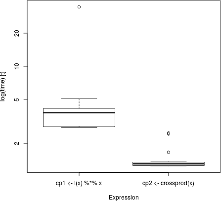

```{r, echo=FALSE}
library(memuse)
matmemsize <- function(n) capture.output(memuse::mu(8*2*(n+1)*n))
```


# Introduction

The **coop** package [[@coop]] does co-operations: covariance, correlation, and cosine similarity.  And it does them in a quick, memory efficient way.

The package has separate, optimized routines for dense matrices and vectors; and currently, there is a cosine similarity method for a sparse matrix (like a term-document/document-term matrix) stored as a "simple triplet matrix" (aij/coo format). The use of each of these methods is seamless to the user by way of R's S3 methods.  A full description of the algorithms, computational complexity, and benchmarks are available in the vignette *Algorithms and Benchmarks for the coop Package* [[@coop2016algos]].  
 
When building/using this package, you will see the biggest performance improvements, in decreasing order of value, by using:

1. A good **BLAS** library
2. A compiler supporting OpenMP [[@openmp]] (preferably version 4 or better).

See the section below for more details.


## Why Put this in a Package?
The way R computes covariance and pearson correlation is unreasonably slow.  Additionally, there is no function built into R to compute the all-pairwise cosine similarities of the columns of a matrix.  As such, you will find people across the R community computing cosine similarity in a myriad of bizarre, often inefficient, ways.  In fact, some of them are even incorrect!

The operation `cosine()` provided by this package is simple, but it is important enough, particularly to fields like text mining, to have a good, high performance implementation.

## Installation
You can install the stable version from CRAN using the usual `install.packages()`:

```r
install.packages("coop")
```

The development version is maintained on GitHub.  You can install this version using any of the well-known installer packages available to R:

```r
### Pick your preference
devtools::install_github("wrathematics/coop")
ghit::install_github("wrathematics/coop")
remotes::install_github("wrathematics/coop")
```


## A Note on the C Library
The "workhorse" C source code is separated from the R wrapper code.  So it easily builds as a standalone shared library after removing the file `src/wrapper.c`.  Additionally, like the rest of the package, the C shared library code is licensed under the permissive 2-clause BSD license.


# Choice of BLAS Library
This topic has been written about endlessly, so we will only briefly summarize the topic here.  The **coop** package heavily depends on "Basic Linear Algebra Subprograms", or **BLAS** [[@lawson1979basic]] operations.  R ships the reference **BLAS** [[@lawson1979basic]] which are known to have poor performance.  Modern re-implementations of the **BLAS** library have identical API and should generally produce similar outputs from the same input, but they are instrumented to be very high performance.  These high-performance versions take advantage of things like vector instructions ("vectorization") and multiple processor cores.

Several well-supported high performance **BLAS** libraries used today are Intel **MKL** [[@mkl]] and AMD **ACML** [[@acml]], both of which are proprietary and can, depending on circumstances, require paying for a license to use.  There are also good open source implementations, such as **OpenBLAS** [[@**OpenBLAS**]], which is perhaps the best of the free options.  Another free **BLAS** library which will outperform the reference **BLAS** is Atlas [[@atlas]], although there is generally no good reason to use **Atlas** over **OpenBLAS**; so if possible, one should choose **OpenBLAS** over Atlas. In addition to merely being faster on a single core, all of the above named **BLAS** libraries except for Atlas is multi-threaded.

If you're on Linux, you can generally use **OpenBLAS** with R without too much trouble.  For example, on Ubuntu you can simply run:

```
sudo apt-get install libopenblas-dev
sudo update-alternatives --config libblas.so.3
```

Users on other platforms like Windows or Mac (which I know considerably less about) might consider using Revolution R Open, which ships with Intel MKL.


# The Operations

Covariance and correlation should largely need no introduction. Cosine similarity is commonly needed in, for example, natural language processing, where the cosine similarity coefficients of all columns of a term-document or document-term matrix is needed.


## Covariance 

### Definition
The covariance matrix of an $m\times n$ matrix $A$ can be computed by first standardizing the data:

$$
covar(A) = \frac{1}{n-1}\sum_{i=1}^m\left(x_i-\mu_x\right)^T\left(x_i-\mu_x\right)
$$
where $x_i$ is row $i$ of $A$, and $\mu_x$ is a vector of the column means of $A$.


### Computing Covariances
Although covariance is often stated as above, it is generally not computed in this way.  For example, in R, which uses column-major matrix order, operating by rows will lead to very poor performance due to unnecessary cache misses.  Instead, we will want to first sweep the column means from each corresponding column and then compute a crossproduct.  In R, this necessarily requires a copy of the data (for the sweep operation).

In R, we can use the `cov()` function.  It does not use the BLAS to do so, and is likely otherwise un-optimised.  However, we note that it has multiple ways of handling `NA`'s.  Implementing the computation in a more runtime efficient way in R is simple:

```r
cov2 <- function(x)
{
  1/(NROW(x)-1) * crossprod(scale(x, TRUE, FALSE))
}
```

And indeed, this is a simplified R version of how the computation is performed in **coop**'s `covar()`, the latter being written in C.  For very small matrices, the `cov()` version is likely to dominate `cov2()`.  But for even modest sized data (and good BLAS), `cov2()` will win out:

```r
m <- 500
n <- 100
x <- matrix(rnorm(m*n), m, n)

rbenchmark::benchmark(cov(x), cov2(x), columns=c("test", "replications", "elapsed", "relative"))
##      test replications elapsed relative
## 2 cov2(x)          100   0.246    1.000
## 1  cov(x)          100   0.435    1.768
```


## Correlation

We restrict our discussion solely to pearson correlation. 

### Definition
This is really just a minor modification of covariance.  The correlation matrix of an $m\times n$ matrix $A$ is given by:

$$
pcor(A) = \frac{1}{n-1}\sum_{i=1}^m \frac{\left(x_i-\mu_x\right)^T\left(x_i-\mu_x\right)}{\sigma_x}
$$
where $x_i$ and $\mu_x$ are as before, and $\sigma_x$ is a vector of the column standard deviations of $A$.


### Computing Correlations
As easily guessed, we need only make a trivial modification of the above covariance function to get correlation:

```r
cor2 <- function(x)
{
  1/(NROW(x)-1) * crossprod(scale(x, TRUE, TRUE))
}
```


## Cosine Similarity

### Definition
Given two vectors $x$ and $y$ each of length $m$, we can define the *cosine similarity* of the two vectors as 

$$
cosim(x,y) = \frac{x\cdot y}{\|x\| \|y\|}
$$

This is the cosine of the angle between the two vectors.  This is very similar to pearson correlation.  In fact, if the vectors $x$ and $y$ have their means removed, it is identical.  

$$
\rho(x,y) = \frac{(x - \bar{x}) \cdot (y - \bar{y})}{\|x - \bar{x}\| \|y - \bar{y}\|}
$$

Given an $m\times n$ matrix $A$, we can define the *cosine similarity* by extending the above definition to

$$
cosim(A) = \left[ cosim(A_{*,i}, A_{*,j}) \right]_{n\times n}
$$

Where $A_{*,i}$ denotes the i'th column vector of $A$.  In words, this is the matrix of all possible pairwise cosine similarities of the columns of the matrix $A$. 
<!-- ** -->


### Computing Cosines
We begin with a naive implementation.  Proceeding directly from the definition, we can easily compute the cosine of two vectors as follows:

```r
cosine <- function(x, y)
{
  cp <- t(x) %*% y
  normx <- sqrt(t(x) %*% x)
  normy <- sqrt(t(y) %*% y)
  cp / normx / normy
}
```

This might lead us to generalize to a matrix by defining the function to operate recursively or iteratively on the above construction.  In fact, this is precisely how the **lsa** package [[@lsa]] computes cosine similarity.  And while this captures the mathematical spirit of the operation, it ignores how computers actually operate on data in some critical ways.

Notably, this will only use the so-called "Level 1" **BLAS**.  **BLAS** operations are enumerated 1 through 3, for vector-vector, matrix-vector, and matrix-matrix operations.  The higher level operations are much more cache efficient, and so can achieve significant performance improvements over the lower level **BLAS** operations.  Since we wish to perform a full crossproduct (what numerical people call a "rank-k update"), we will achieve much better performance with the level 2 **BLAS** operations.

However, we can massively improve the runtime performance by being slightly more careful in which R functions we use.  Consider for example:

```r
cosine <- function(x)
{
  cp <- crossprod(x)
  rtdg <- sqrt(diag(cp))
  cos <- cp / tcrossprod(rtdg)
  return(cos)
}
```

The main reason this will *significantly* outperform the naive implementation is because it makes very efficient use of the **BLAS**.  Additionally, `crossprod()` and `tcrossprod()` are actually optimized to not only avoid the unnecessary copy in explicitly forming the transpose (produced when `t()` is called), but they only compute one triangle of the desired matrix and copy it over to the other, essentially doing only half the work.  These operations alone allow for significant improvement in performance:

```r
n <- 250
x <- matrix(rnorm(n*n), n, n)

mb <- microbenchmark::microbenchmark(t(x) %*% x, crossprod(x), times=20)
boxplot(mb)
```



One can easily numerically verify that these are identical computations.  However, this implementation is not memory efficient, as it requires the allocation  of additional storage for:

1. $n\times n$ elements for the `crossprod()`
2. $n$ elements for `diag()`
3. Another $n$ elements just for the `sqrt()`
4. $n\times n$ elements for the `tcrossprod()`

The final output storage is the result of the division of `cp` by the result of `tcrossprod()`.   So the total number of *intermediary* elements allocated is `2n(n+1)`.  So for an input matrix with 1000 columns, you need `r matmemsize(1000)` of additional memory, and for one with 10000 columns, you need `r matmemsize(10000)` of additional storage.  For a smaller matrix, this may be satisfactory. 

By comparison, the implementation in **coop** needs no additional storage for computing cosines (to be more precise, the storage is $O(1)$).  The implementation for two dense vector inputs is dominated by the product \code{t(x) \%*\% y} performed by the **BLAS** subroutine  \code{dgemm} and the normalizing products \code{t(y) \%*\% y}, each computed via the **BLAS** function \code{dsyrk}.  For more details, see the vignette *Algorithms and Benchmarks for the coop Package*.


# References
<script language="JavaScript" src="include/headers.js"></script>
